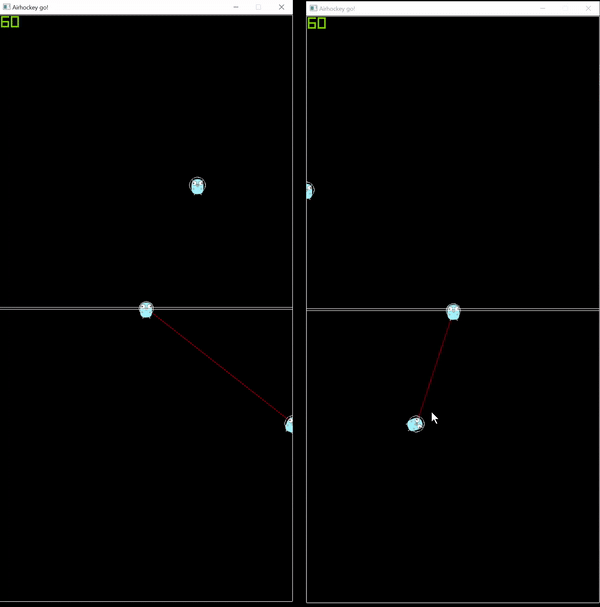
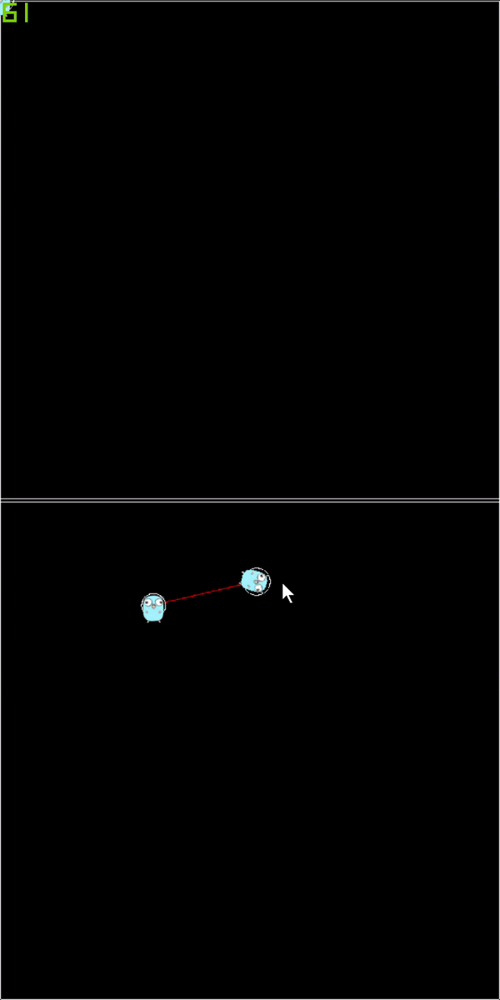
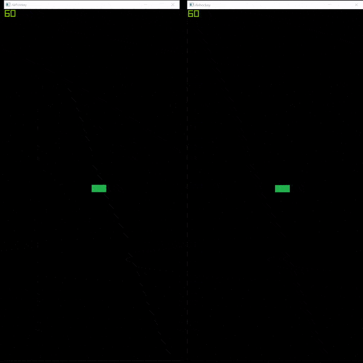

# Airhockey multiplayer with gRPC and GO

Simple standalone app of airhockey fully implemented in go and gRPC using ebiten

# Setup
## Requirements
- Go 1.16 or newer
- protobuf 3
- github.com/envoyproxy/protoc-gen-validate
## How to run
- In the root folder run `go mod tidy`
- Windows
  - Run `.\generate.bat`
  - Start the server
- Linux/MacOs
  - Rename the file `generate.bat` to `generate.sh`
  - Run `sh generate.sh`

- Run `server(.exe)` and `client(.exe)`
- Enjoy!

## Debug
- On the client press `F6` to show the collisions and enable logging

## Showcase
### Physics

The prototype is provided with a very rudimentary collision system. It allows the disk to be pushed around, collide with the players and the walls

### Network replication

The prototype is capable of multiplayer and replication. If the server is hosted online, multiple devices can join the
same session. The communication is implemented with grpc

